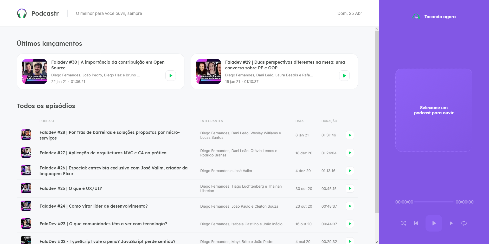
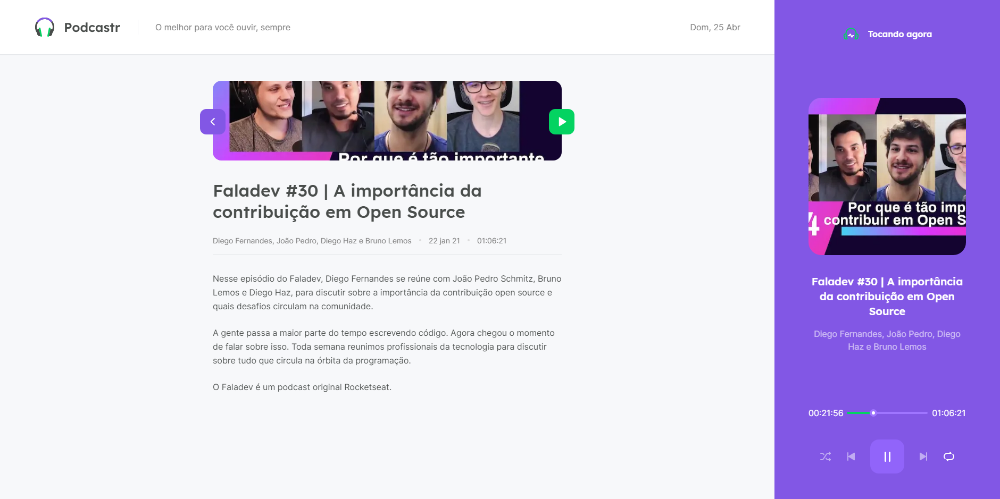

# Podcastr

Projeto desenvolvido durante a NLW #5 da Rocketseat na trilha de React.

## Tecnologias utilizadas

-   ReactJS

-   Next.js

-   Typescript

-	SASS

-   SSR e SSG

-   JSON Server

## Home

## Detalhes do podcast

